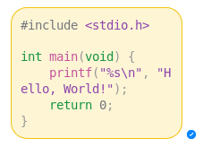
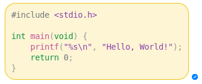

A recent update to [Facebook Messenger](http://www.messenger.com) has broken the way code blocks are displayed by giving them a very thin fixed width..

This CSS fixes the problem and gives you the code blocks you deserve.

## Before:

## After:

